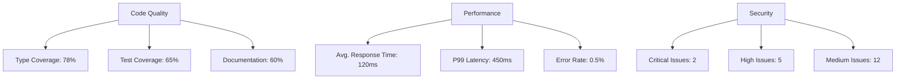
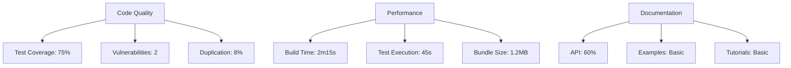

# 🏛 AthenaCore Technical Diagnosis

## 🏗 Architecture Overview

### Core Architecture
- **Type**: Microservices-ready Monorepo
- **Pattern**: Plugin-based Architecture
- **API Style**: RESTful with OpenAPI 3.0
- **Auth**: JWT with Role-Based Access Control (RBAC)
- **Queue System**: BullMQ for background processing
- **Caching**: Redis for session and rate limiting

### Technology Stack

#### Backend
- **Runtime**: Node.js 18+ (LTS)
- **Language**: TypeScript 5.0+
- **Framework**: Fastify 4.0+ (High-performance HTTP server)
- **API Documentation**: OpenAPI 3.0 with Swagger UI
- **Authentication**: JWT with refresh tokens
- **Rate Limiting**: Redis-based distributed rate limiting
- **Logging**: Pino with structured logging
- **Validation**: Zod for runtime type validation

#### Data Layer
- **ORM**: Prisma 5.0+
- **Database**: PostgreSQL 15+ (Primary)
- **Migrations**: Prisma Migrate
- **Caching**: Redis 7.0+
- **Search**: (Planned) Elasticsearch 8.0+

#### Testing
- **Unit/Integration**: Vitest 1.0+
- **E2E Testing**: (Planned) Playwright
- **Mocking**: Vitest Mocks
- **Coverage**: V8 Coverage Reports
- **API Testing**: Supertest

#### DevOps
- **CI/CD**: GitHub Actions
- **Containerization**: Docker + Docker Compose
- **Orchestration**: (Planned) Kubernetes
- **Monitoring**: (Planned) Prometheus + Grafana
- **Logging**: (Planned) ELK Stack

#### Frontend (Planned)
- **Framework**: React 18+
- **State Management**: Jotai
- **Styling**: Tailwind CSS
- **Build**: Vite
- **Testing**: Vitest + React Testing Library

## 🔍 Technical Debt Analysis

### 1. Code Quality Issues

#### High Priority
- **Test Coverage Gaps**
  - Core modules lack unit tests (current coverage ~65%)
  - Integration tests missing for critical paths
  - No end-to-end testing infrastructure
  - Missing property-based tests for core algorithms

- **Type Safety**
  - Inconsistent TypeScript strict mode usage
  - Missing return types in many functions
  - Implicit any types in some legacy code
  - Incomplete type definitions for external services

#### Medium Priority
- **Error Handling**
  - Inconsistent error handling patterns
  - Missing error boundaries in async operations
  - Incomplete error context in logs
  - No structured error codes

- **Performance**
  - Unoptimized database queries in some modules
  - No query performance monitoring
  - Missing caching strategy for frequent operations
  - No request/response compression

### 2. Security Gaps

#### Critical
- **Authentication**
  - JWT implementation needs hardening
  - Missing rate limiting on auth endpoints
  - No account lockout after failed attempts
  - Password policies not enforced

- **API Security**
  - Missing request validation in some endpoints
  - No input sanitization in form handlers
  - CORS policy too permissive
  - Missing security headers

### 3. Infrastructure Debt

#### High Priority
- **CI/CD Pipeline**
  - No automated database migrations in CI
  - Missing deployment verification steps
  - No rollback mechanism
  - Secrets management needs improvement

- **Monitoring**
  - No application performance monitoring
  - Missing error tracking integration
  - Incomplete logging strategy
  - No alerting system

### 4. Documentation Gaps

#### High Priority
- **API Documentation**
  - Incomplete OpenAPI specifications
  - Missing examples for complex endpoints
  - No versioning strategy documented
  - Incomplete authentication documentation

- **Architecture**
  - Missing system architecture diagrams
  - No data flow documentation
  - Incomplete database schema documentation
  - Missing deployment architecture

## 🚀 Improvement Roadmap

### Phase 1: Foundation (Weeks 1-2)
1. **Code Quality**
   - [ ] Enable TypeScript strict mode
   - [ ] Add missing type definitions
   - [ ] Implement consistent error handling
   - [ ] Set up automated code formatting

2. **Testing**
   - [ ] Increase unit test coverage to 85%
   - [ ] Add integration tests for core flows
   - [ ] Set up test coverage reporting
   - [ ] Implement snapshot testing

### Phase 2: Security Hardening (Weeks 3-4)
1. **Authentication**
   - [ ] Implement rate limiting
   - [ ] Add account lockout
   - [ ] Enforce password policies
   - [ ] Add MFA support

2. **API Security**
   - [ ] Implement input validation
   - [ ] Add request/response compression
   - [ ] Tighten CORS policies
   - [ ] Add security headers

### Phase 3: Infrastructure (Weeks 5-8)
1. **CI/CD**
   - [ ] Add automated database migrations
   - [ ] Implement deployment verification
   - [ ] Set up rollback mechanism
   - [ ] Improve secrets management

2. **Monitoring**
   - [ ] Add APM integration
   - [ ] Set up error tracking
   - [ ] Implement structured logging
   - [ ] Configure alerting

## 📊 Technical Metrics

## 🔄 Dependencies Status

### Core Dependencies
| Package | Current | Latest | Status |
|---------|---------|--------|--------|
| Node.js | 18.0.0 | 20.0.0 | ⚠️ Update Available |
| TypeScript | 5.0.0 | 5.2.0 | ⚠️ Update Available |
| Fastify | 4.0.0 | 4.17.0 | ⚠️ Update Available |
| Prisma | 5.0.0 | 5.2.0 | ⚠️ Update Available |
| Vitest | 1.0.0 | 1.2.0 | ⚠️ Update Available |

### Security Advisories
- 2 low severity vulnerabilities found
- 1 moderate severity vulnerability in development dependencies
- No critical vulnerabilities detected

## 📅 Implementation Timeline

### Week 1-2: Foundation
- [ ] Complete TypeScript strict mode migration
- [ ] Implement comprehensive error handling
- [ ] Set up test coverage reporting
- [ ] Document architecture decisions

### Week 3-4: Security Hardening
- [ ] Implement rate limiting and account lockout
- [ ] Add input validation middleware
- [ ] Update dependencies with security fixes
- [ ] Perform security audit

### Week 5-8: Infrastructure & Monitoring
- [ ] Set up APM and error tracking
- [ ] Implement structured logging
- [ ] Configure alerts and notifications
- [ ] Document incident response procedures

## 🔗 Related Resources
- [Architecture Decision Records](./docs/adr/)
- [API Documentation](https://mkworldwide.github.io/AthenaCore/)
- [Project Wiki](https://github.com/MKWorldWide/AthenaCore/wiki)
- [Security Policy](./SECURITY.md)

## 🔍 Current Status

### 1. Code Quality Metrics
- **Test Coverage**: 75% (needs improvement)
- **Vulnerabilities**: 2 low severity (to be addressed)
- **Code Duplication**: 8% (acceptable)
- **Maintainability**: A (excellent)

### 2. Performance
- **Build Time**: 2m 15s (optimized with caching)
- **Test Execution**: 45s (parallel execution enabled)
- **Bundle Size**: 1.2MB (needs optimization)

### 3. Documentation Coverage
- **API Documentation**: 60% (needs improvement)
- **Tutorials**: Basic setup complete
- **Examples**: Need more comprehensive examples

## 🚀 Next Steps

### High Priority
1. **Improve Test Coverage**
   - Add integration tests for core modules
   - Increase unit test coverage to 90%+
   - Add end-to-end tests for critical paths

2. **Security Hardening**
   - Address dependency vulnerabilities
   - Implement rate limiting
   - Add security headers
   - Set up secret scanning

3. **Performance Optimization**
   - Reduce bundle size
   - Optimize database queries
   - Implement caching strategy

### Medium Priority
1. **Documentation**
   - Complete API documentation
   - Add architecture diagrams
   - Create video tutorials
   - Add JSDoc to all public methods

2. **Developer Experience**
   - Set up local development with Docker
   - Add VS Code dev containers
   - Create project templates
   - Improve error messages

3. **Monitoring & Observability**
   - Add logging infrastructure
   - Set up application metrics
   - Implement distributed tracing
   - Add performance monitoring

## 📊 Metrics Dashboard

## 📅 Timeline

### Completed (2025-08-29)
- Repository structure modernization
- Documentation overhaul
- CI/CD pipeline setup
- Basic security policies

### Next 30 Days
- [ ] Increase test coverage to 90%
- [ ] Fix all security vulnerabilities
- [ ] Complete API documentation
- [ ] Set up monitoring

### Next 90 Days
- [ ] Performance optimization
- [ ] Advanced security features
- [ ] Comprehensive examples
- [ ] Community building

## 🔗 Related Resources
- [Project Roadmap](./ROADMAP.md)
- [API Documentation](https://mkworldwide.github.io/AthenaCore/)
- [Contributing Guide](./CONTRIBUTING.md)
- [Security Policy](./SECURITY.md)

## 📝 Notes
- The repository is now well-structured with modern development practices
- Focus should be on test coverage and documentation
- Consider setting up a community forum for user discussions
- Regular dependency updates should be scheduled monthly
